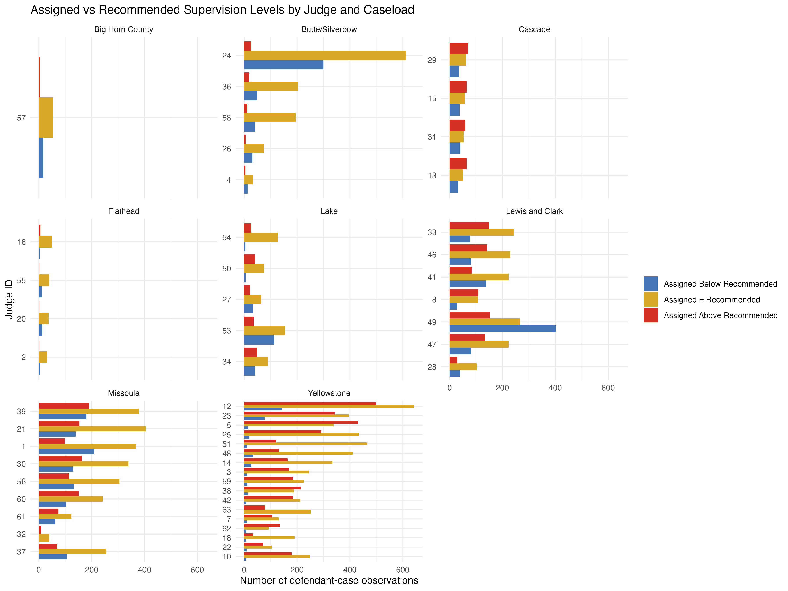
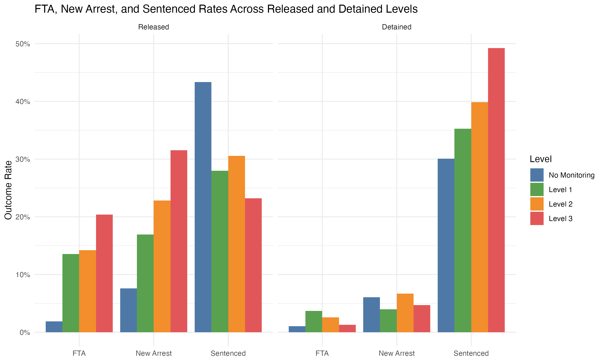
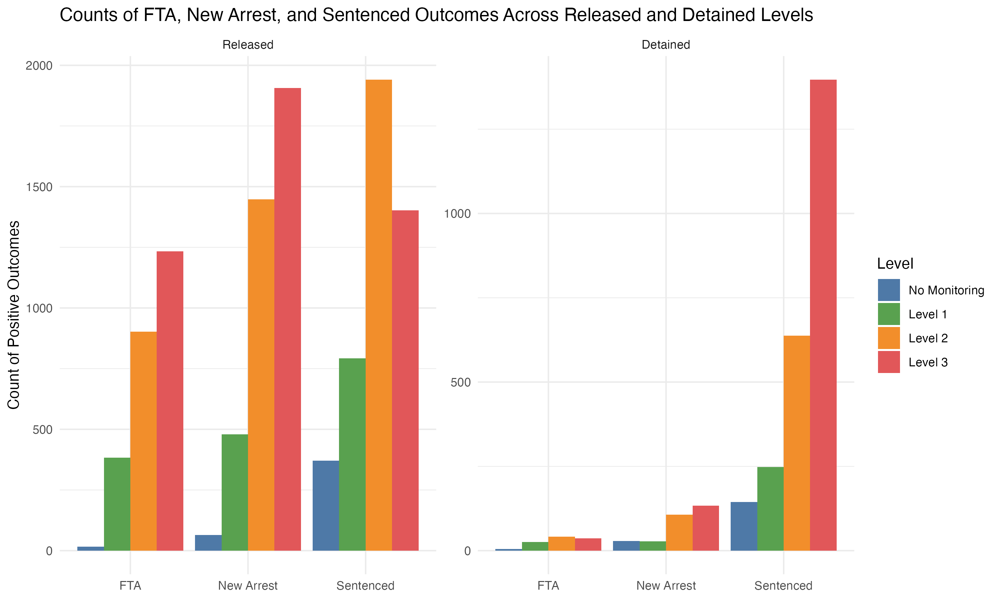
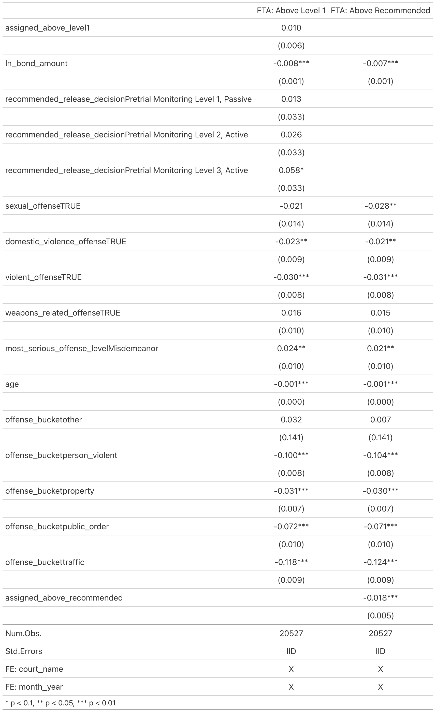
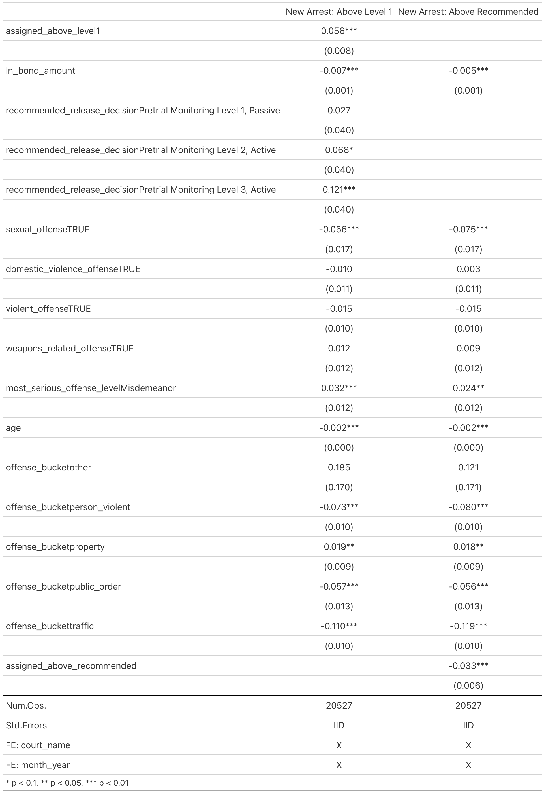
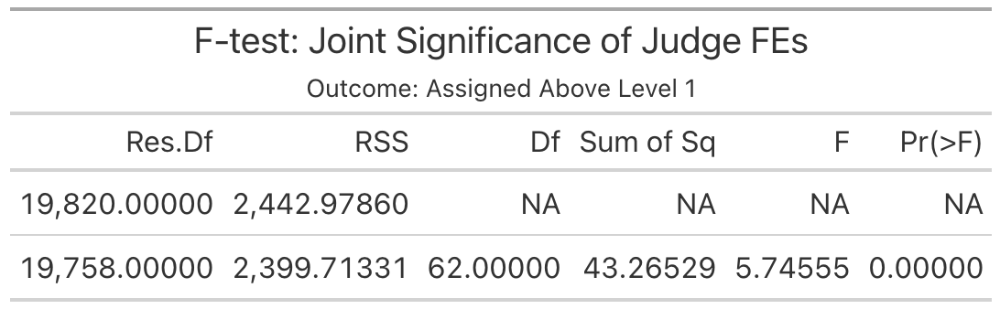
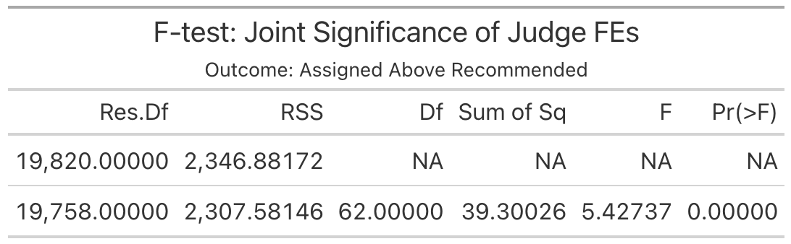

# Draft Exploratory Analysis

### Topic

This project examines how harsher pretrial supervision levels are associated with future defendant outcomes. More specifically, I study whether defendants assigned to more intensive forms of supervision appear more likely to experience outcomes such as failing to appear in court for their next hearing, getting re-arrested during the pretrial period, and getting sentenced. I will consider two forms of "intensity" of supervision: 

1. A judge assigning a defendant to release with conditions vs release with no conditions, and 
2. A judge assigning a level of supervision higher than the "recommended" level. I can propose a "recommended" level using a level generated by a risk assessment tool called the Public Safety Assessment (PSA). The advantage of my data is that all cases in my analysis have such a risk score and supervision level recommendation tied to it. 

### Motivation

The broader motivation is that pretrial supervision is meant to manage risk while avoiding unnecessary detention, but in practice harsher supervision could also affect defendants in a way that is criminogenic (e.g. less flexibility to spend time with loved ones, anxiety about missing check ins, etc.). Anecdotally, various officials within the pretrial space have noted that judges tend to overassign pretrial risk conditions to hedge their bets. So much so that oftentimes released defendants who should be presumed innocent are assigned more conditions than sentenced probationers. Given the possible prevalence of this tendency, I wanted to understand these patterns of overconditioning as a first step before moving to a more formal causal analysis.

My research question is whether more restrictive supervision is associated with worse or better defendant outcomes. The analysis is intended to describe how  outcome variables, and visualize how outcomes vary across supervision categories and judges. I focus on judges in order to produce preliminary validation of using a judge IV to recover plausibly causal estimates. 

### Data 

The data come from Montana pretrial case records from AutoMon, the case management system used by the Montana Pretrial Services Team. The cleaned dataset is at the case-defendant level, meaning that each row corresponds to a defendant for a specific case. This is appropriate for my descriptive analysis because the outcomes of interest such as failure to appear, new arrest, and sentencing are tied to defendant-case histories.

### Data Cleaning and Preparation

The analysis begins with a raw case-defendant level administrative file that includes identifiers, court and judge information, dates, bond information, release decisions, and disposition fields. I first standardized variable names to a simple snake_case version and I then restricted the sample to the subset of cases directly tied with PSA scores and recommended supervision levels.

Several filtering decisions were made to improve data quality and comparability. I excluded caseloads (counties) that did not implement the pretrial assessments consistently as indicated by the pretrial program staff. I removed observations marked for deletion, observations with clearly invalid placeholder case numbers, municipal court cases that do not use the same pretrial procedures, and cases dismissed because of a defendant's death. I later transform the bond amount using log1p() to deal with its wide range and skewness while not dropping the zero bonds (release on own recognizance, which is not uncommon). I also addressed extreme ages by checking against the defendant case files for their correct date of birth in the PSA report. Lastly, I corrected supervision start dates that were returning negative days on supervision due to incorrectly entered dates. Most were easily detectable and correctable errors but I had to drop one of these observations where the true supervision start date was ambiguous. 

After cleaning, the unit of analysis in the merged dataset is the defendant-case with each observation tied to a PSA score. This is the level at which I define detention status, supervision assignment, failure to appear (FTA), sentencing and new arrests during the pretrial period. 

I then constructed several key variables for the analysis. First, I created a detained indicator equal to one when no release date was recorded and zero otherwise. Next, I coded supervision-assignment categories based on the recorded release decision. I grouped "Reminder Only" assigned releases together with Level 1 supervision, since it is the least intensive monitored category and conceptually closest to being assigned passive supervision. 

From these assignments, I created an **assigned_above_recommended** indicator variable set to 1 when a defendant was assigned a higher release level than what the PSA recommended. I also created a **assigned_above_level1** indicator which captures assignments to levels 2 and 3 which add conditions (vs level 1 which is essentially release with no conditions). Note: strict detainment rarely occurs as judges do not often deny bail. Those under detention after their initial hearing are likely defendants who were assigned levels 2 or 3 but who did not pay their bond. 

The main outcome variables are three binary indicators:

- **fta**: whether the disposition reasons indicate failure to appear for the next court hearing.
- **new_arrest**: whether the disposition reasons indicate a new arrest during the pretrial period.
- **sentenced**: whether the disposition reasons indicate that the defendant was sentenced.

One limitation of these binary indicators is because they are derived from disposition reasons entries, failure to appear, sentencing and new arrests may be underreported if the disposition reason is not correctly entered by the case manager. In addition, if one defendant has multiple active cases, it may be that a new arrest is flagged on all the active cases which may result in double counting of some outcomes. 

### Visualizations

**Release Above, Exactly, and Below recommendation by Judge and Caseload**

The first figure shows the number of the defendant-cases that a judge assigns a supervision level either above, below or at exactly the recommended supervision level by judge, separated by counties. Judges were assigned anonymous judge identifiers. I restricted the figure to judge-caseload cells with more than thirty defendant-cases to focus on patterns for judges who saw a sizeable number of defendants.

This figure is useful for descriptive purposes because it shows that judges vary in how they follow the recommended release level  within caseloads. That variation is one reason a judge-based IV design may eventually be possible. 

**Outcome Rates Across Released and Detained Supervision Levels**

The next figure compares the rates of failure to appear, new arrest, and sentencing across supervision levels while breaking it up to see if the behavior differs across whether the defendant is released or detained. Each bar represents the share of defendants in that group that failed to appear, is sentenced, or had a new arrest for that case.

This figure is the most directly connected to my research question. It summarizes how outcomes differ across increasingly intensive supervision categories. The interpretation is not that harsher supervision causes worse outcomes but rather points to why OLS would be biased. We see that higher supervision levels are associated with higher rates of adverse outcomes, which would be consistent with a selection of riskier defendants into harsher categories. 

The distinction between released and detained categories is also important. Released defendants face direct opportunities for failure to appear and new arrest in ways that detained defendants do not, so comparing the two panels helps clarify how much of the observed pattern comes from supervision level versus release status more generally. 

**Counts of Positive Outcomes Across Released and Detained Supervision Levels**

The final figure presents the same outcomes using counts rather than rates. This complements the previous graph because percentages can sometimes hide differences in sample size as we see in the unexpected pattern of sentencing rate for released defendants above. This pattern is closer to what would we expect with the selection story we reviewed.

**Interpretation and Preliminary Takeaways**

Taken together, the figures suggest that the data contain meaningful variation in both judicial release behavior and defendant outcomes across supervision categories. 

They also suggest that a central challenge in interpreting these patterns is selection. Defendants assigned to harsher supervision are unlikely to be comparable to defendants assigned to less intensive supervision. Higher-risk defendants are like sorted into more restrictive categories precisely because they are expected to have worse outcomes. Hence, the current visualizations should be read as describing associations rather than causal treatment effects. 

# Final Exploratory Analysis + Econometric Analysis

### Motivation

This is a descriptive project done as a first step towards causal inference. The reason it cannot be characterized as causal is that the naive OLS regression suffers from selection bias, even with FEs. It is not a predictive question either as we are not interested in predicting whether a defendant will fail to appear or will get rearrested. In fact, the risk assessment already does this and instead we are interested in getting the causal effect of various supervision levels on defendant outcomes.  

### Methods 

For the two alternative treatment variables, these are the naive regression models for each outcome of interest:

$$y_{ic} =  \beta_1 D_{ic} +
    \gamma \bar{X}_{ic} + \alpha _{c} + \delta _{t} + \epsilon_{ic} $$

where $y_{ic}$ is either Failure to Appear or New Arrest posttrial, $D_{ic}$ is either $AssignedAboveLevel1$ or $AssignedAboveRecommended$ (in which case $RecommendedLevel$ would be excluded), $\bar{X}_{ic}$ are charge and defendant controls, $\alpha _{c}$ is a county FE, and $\delta _{t}$ is a month-year FE.

I then also estimate a quasi-first stage regression in order to test the joint significance of judge FEs in explaining variation in the treatment variables:

$$D_{ic} =  \sum_j \theta_j 1[Judge = j] +
    \gamma \bar{X}_{ic} + \alpha _{c} + \delta _{t} + \varepsilon_{ic} $$

### Results

**Naive OLS regressions of release with conditions (above level 1) and released above recommended level on FTA**

This shows that, holding all else constant, being assigned to a release with conditions is associated with a 1 percentage point increase in the probability of failure to appear. This corresponds to an approximately 8% increase relative to the baseline mean FTA rate (12.2%). 

**Naive OLS regressions of release with conditions (above level 1) and released above recommended level on New Arrests**

This shows that, holding all else constant, being assigned to a release level higher than recommended is associated with a 1.8 percentage point decrease in the probability of failure to appear. This corresponds to an approximately 14.75% decrease relative to the baseline mean FTA rate (12.2%).

**Joint significance of judge FE on being assigned to release with conditions (above level 1)**

**Joint significance of judge FE on being assigned to release above recommended release level**
  

These two ANOVA tables indicate that, after controlling for a number of characteristics such as offense type, age, court, month, charge severity, and most importantly the PSA recommendation (which should control for a large portion of the predictive risk), judges are still a relevant source of variation in whether a defendant is assigned to release with conditions (above level 1) and whether  a defendant is assigned to a release level above the recommended. This suggests that a judge FE may pass the relevance assumption needed for an IV. 

In terms of causal inference, the OLS regressions do not provide causal estimates due to the remaining selection bias. This likely upwardly biases the outcome variables for harsher release level treatments. 

But even if we were to use a judge IV to get LATE estimates, there would still remain concerns about the exclusion restriction assumption. Most notably, judges can affect defendant outcomes through more channels than the supervision level: they can also influence outcomes through the bond set. In order to isolate this, I would likely isolate the comparison to level 1 and level 2 releases as a proxy of no conditions vs conditions because only level 3 releases should be assigned bonds. This would also solve the problem of ensuring ordered treatment and monotonicity in treatment assignment. This is important because if it were violated and treatment effect heterogeneity existed, the judge IV would not cleanly recover even LATE estimates.
